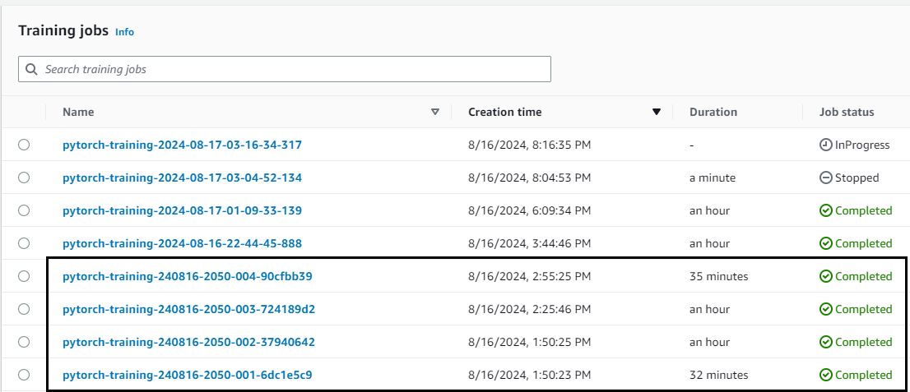
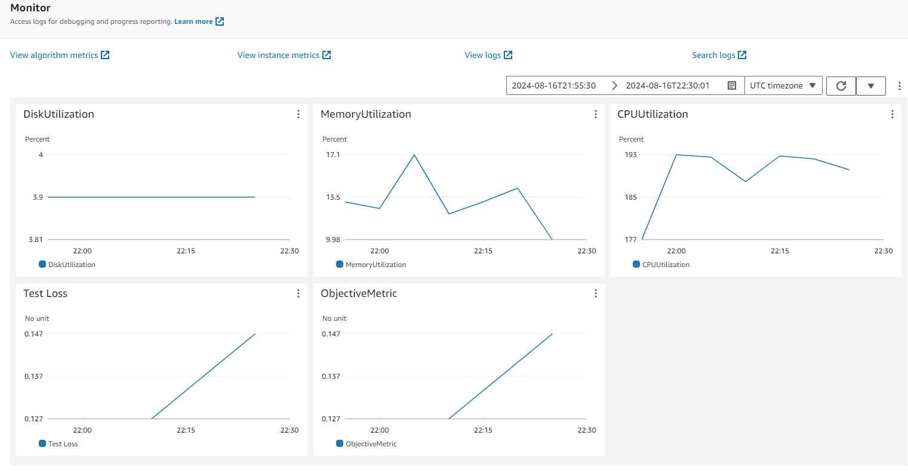
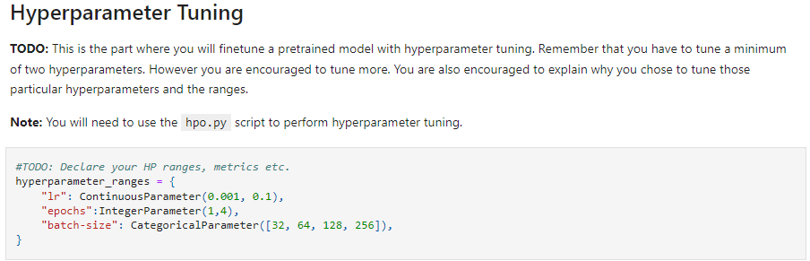
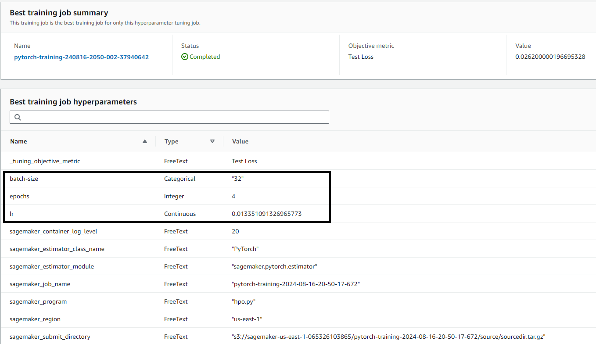
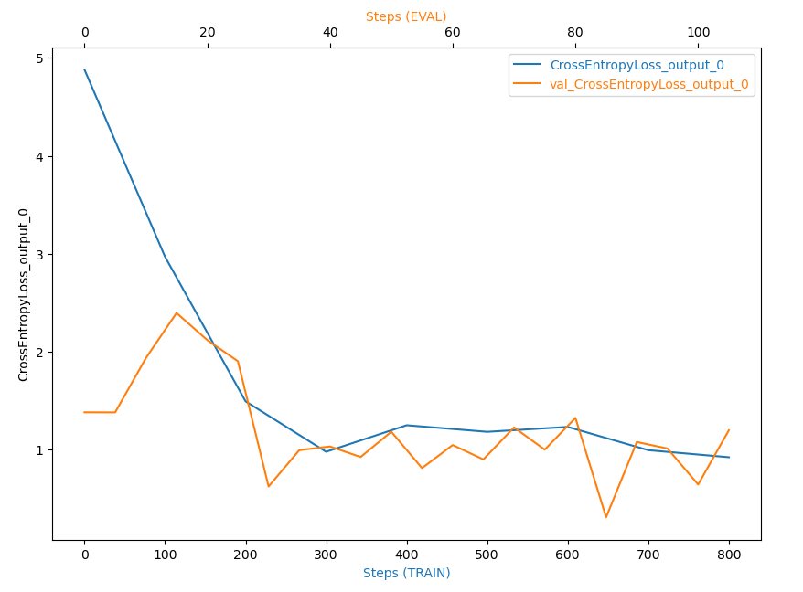
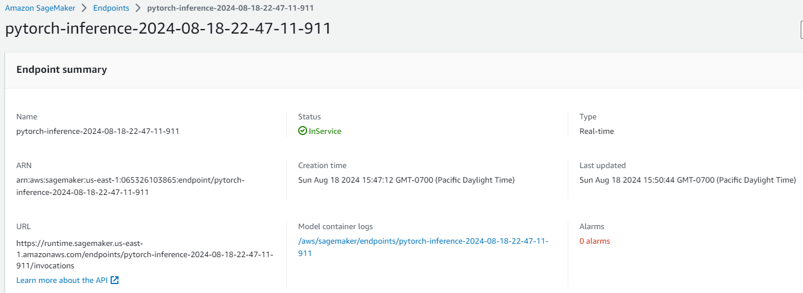
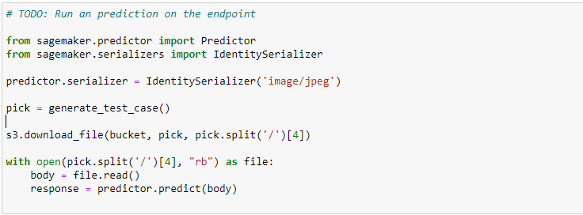

# Image Classification using AWS SageMaker

I used AWS Sagemaker to train a pretrained model that can perform image classification by using Sagemaker profiling, debugger, and hyperparameter tuning. I will be using the dog breed dataset to train a model to correctly indentify the dog breed of a dog in a picture. 

## Project Set Up and Installation
Entered AWS through the gateway in the course and opened SageMaker Studio and downloaded the starter files to my Sagemaker directory.

## Dataset
The dataset is the dogbreed classification dataset. The image classifier can take in any type of dataset for training, however the dog breed dataset is readily available and provides many images for training.
This dataset was provided by Udacity and is available through AWS. 

### Access
The data was downloaded and unzipped to my sagemaker directory. From there the unzipped package was uploaded to my S3 bucket through the AWS Gateway. 

## Hyperparameter Tuning
RESNET50 was the model chosen for the image classifier due to it providing more accuracy than RESNET18.
The hyperparameters chosen for tuning were.
  1. Batch size
  2. learning rate
  3. epochs

Learning rate is how quickly the weights are adjusted, so if the weights are adjusted too quickly then the model may overshoot in either direction in getting to the optimal set of weights.
The learning rate chosen was between 0.001 and 0.1.

Batch size is the number of samples used to make an evaluation. After each batch the weights are adjusted, so if the batch size is very large training will be quick but the model will not be accurate, while
small batch sizes will increase training time and the model will be more accurate. Batch sizes chosen were 32, 64, 128 and 256, anything bigger would need more memory and possibly more processors.

Epochs is the number times to retrain the model to make adjustments to the weights. While retraining helps to make a better model, too much training will cause overfitting of the data. Epochs chosen
were 1 through 4, 

- Completed training jobs

- Logs metrics during the training process

- Three hyperparameters tuned

- Best hyperparameters from all the training jobs

## Debugging and Profiling
Debugger rules chosen were.

  1. Vanishing Gradient
  2. Overfit
  3. Overtraining
  4. Poor weight initialization
  5. Loss not decreasing

Profiler rules chosen were

  1. LowGPU utilization
  2. ProfilerReport

From the Debugger Plot it appears that the loss function is decreasing for both the training and eval cycles.

### Results
From the profiler report, it shows that no rules were triggered. However the rules with the most datapoints processed were:

  1. Batchsize
  2. CPUBottleneck
  3. IOBottleneck

These rules with the most datapoints are probably due to the CPU being utilized all the time, I never checked to see if a GPU was available to use.
Most of the time GPU's are not available.

## Model Deployment

To deploy the trained model another pytorch model was created using the model data/artifact from the trained model with the best hyperparameters and a new script that contains the
functions for the model, input and prediction/output.

  1. model_fn - loads the saved model from the training and the model configuration.
  2. input_fn - takes in the input passed in to the function that invokes the endpoint
  3. predict_fn - transforms the input the same way the training data was transformed, performs inference and returns the result

- Endpoint Summary

- Invoking the Endpoint

## Standout Suggestions
Would have tried to create my own dockerfile to use to run inferences on sample images, but was running out of budget.
